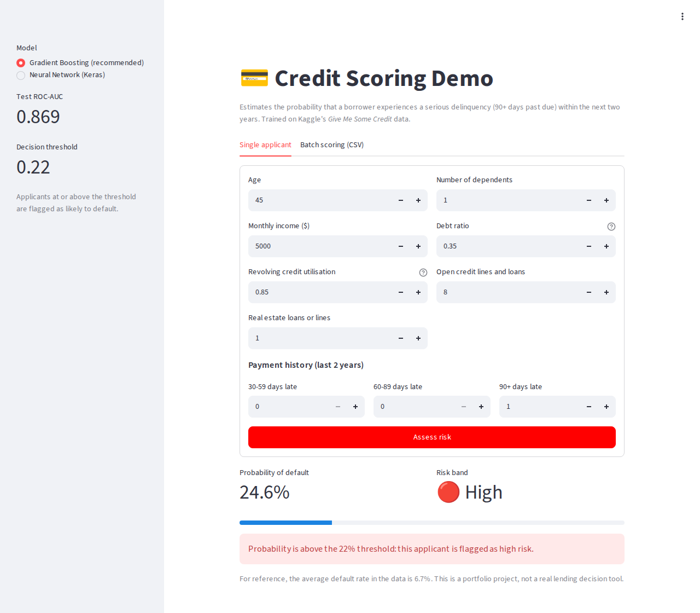
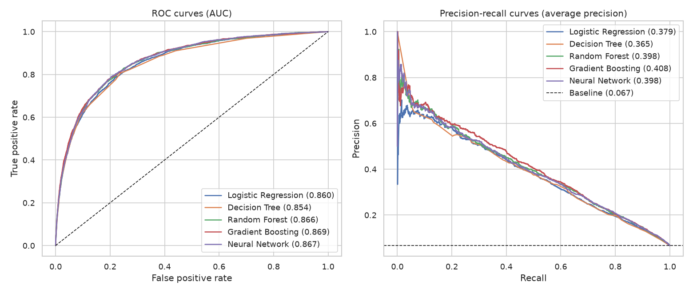
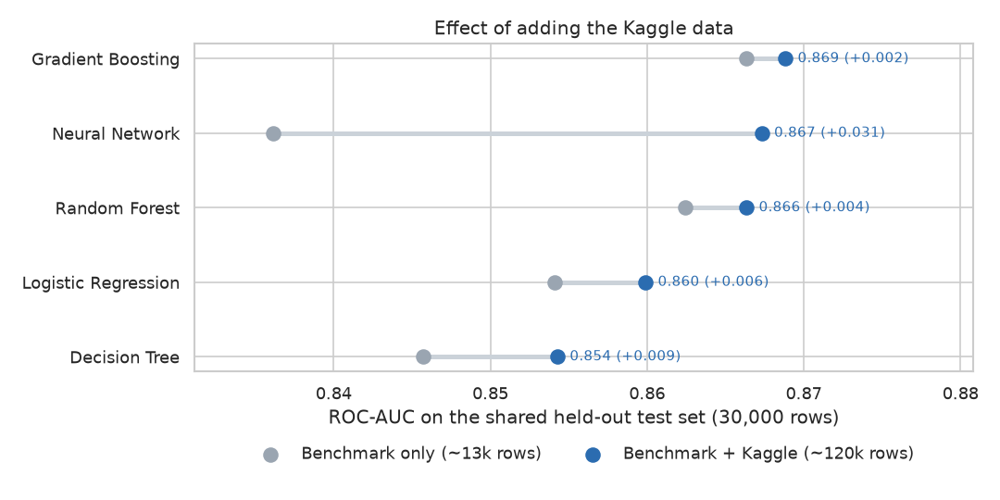
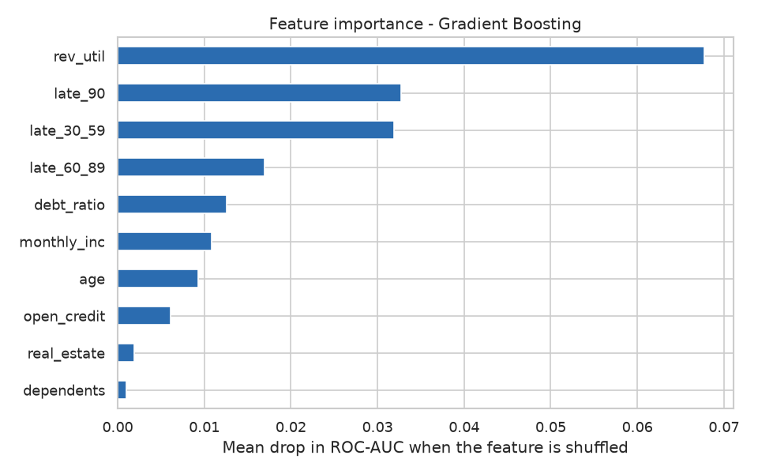

# Credit Scoring: Predicting Loan Default Risk

[](https://codealphacredit-scoring-447gitcd76xs2492bg5yyd.streamlit.app/)


A machine learning project that estimates the probability that a borrower will experience a **serious
delinquency (90+ days past due) within the next two years**, based on their credit history and financial profile.

Built as part of the **CodeAlpha Machine Learning internship** (Task 1: Credit Scoring Model).

**👉 [Try the live demo](https://codealphacredit-scoring-447gitcd76xs2492bg5yyd.streamlit.app/)**

[](https://codealphacredit-scoring-447gitcd76xs2492bg5yyd.streamlit.app/)

## Highlights

- **150,000 borrowers**: the original 16,714-row dataset was traced back to its source, Kaggle's
  [*Give Me Some Credit*](https://www.kaggle.com/c/GiveMeSomeCredit), and extended with the full data.
- **Controlled experiment** showing that the extra data improves every model, especially the neural network (+0.031 ROC-AUC).
- **Five models compared**: Logistic Regression, Decision Tree, Random Forest, Gradient Boosting and a Keras neural network.
- **Best model:** Gradient Boosting, **ROC-AUC 0.869** on 30,000 unseen borrowers.
- **Reproducible pipeline** (`python -m src.train`), a command-line scorer, a **TensorFlow Lite** export and an interactive **Streamlit demo**.

## Results

All models are evaluated on the same held-out test set (30,000 borrowers, 6.7% defaults).

| Model | ROC-AUC | PR-AUC* |
|---|---|---|
| **Gradient Boosting** (selected) | **0.869** | **0.408** |
| Neural Network (Keras) | 0.867 | 0.398 |
| Random Forest | 0.866 | 0.398 |
| Logistic Regression | 0.860 | 0.379 |
| Decision Tree | 0.854 | 0.365 |

<sub>*PR-AUC (average precision) is more informative than accuracy on imbalanced data. A random model scores 0.067.</sub>

At the chosen decision threshold (0.22), the model **catches 50% of defaulters with 40% precision** while
flagging about 8% of applicants. A naive model predicting "no default" for everyone would reach 93% accuracy
and catch none, which is why accuracy is not used here.

<p align="center">
  
</p>

### Does more data help?

The original dataset turned out to be an exact, artificially balanced (50/50) subsample of *Give Me Some Credit*:
every defaulter with complete data plus the same number of random non-defaulters. To measure the value of the
rest of the Kaggle data, each model was trained twice (on the benchmark rows only, then on the full training
split) and scored on the **same** test set:

<p align="center">
  
</p>

- **Every model improves**, on both ROC-AUC and PR-AUC.
- The **neural network gains the most** (+0.031): it goes from last place to a close second.
- Tree ensembles gain less (+0.002 to +0.004) because they already extract most of the signal from 13k rows.
- **Data cleaning matters as much as data volume**: even trained on the benchmark only, the new gradient-boosting
  pipeline (0.866) beats the original notebook's Random Forest (0.855).

### What drives the risk?

<p align="center">
  
</p>

**Revolving credit utilisation** and **past late payments** dominate. A single 90-day late payment multiplies the
observed default rate several times.

## Dataset

| Column | Description |
|---|---|
| `rev_util` | Balance on credit cards and personal credit lines divided by the credit limits |
| `age` | Borrower age (years) |
| `late_30_59` / `late_60_89` / `late_90` | Number of times 30-59 / 60-89 / 90+ days past due in the last 2 years |
| `debt_ratio` | Monthly debt payments, alimony and living costs divided by monthly gross income |
| `monthly_inc` | Monthly income |
| `open_credit` | Number of open loans and lines of credit |
| `real_estate` | Number of mortgage and real estate loans |
| `dependents` | Number of dependents |
| **`dlq_2yrs`** | **Target**: serious delinquency within 2 years (1 = default) |

- `data/credit_risk_benchmark.csv`: the original internship dataset (16,714 rows, balanced).
- `data/raw/cs-training.csv`: *Give Me Some Credit* (150,000 rows, 6.7% defaults). It is **downloaded automatically**
  on first run through the Kaggle API (public CC0 mirror
  [`lihxlhx/give-me-some-credit`](https://www.kaggle.com/datasets/lihxlhx/give-me-some-credit)) and is not stored in the repository.

## Methodology

1. **Exploratory analysis**: distributions, default rates by segment, correlations and data-quality checks.
2. **Cleaning**: the codes 96/98 in the late-payment counters (special values, not real counts), impossible
   utilisation ratios (> 10) and ages under 18 are treated as missing values. Missing values (20% of incomes)
   are imputed with the median inside each pipeline, so the test data never leaks into training.
3. **Feature engineering**: `total_late_payments`, `late_severity_score` (weights 1/2/3 for 30/60/90 days),
   `income_per_dependent`, `monthly_debt` and an `income_missing` flag. Linear models and the neural network also
   get a log transform and standard scaling to tame the heavy-tailed ratios.
4. **Validation**: stratified 80/20 train/test split. The decision threshold is tuned on 5-fold out-of-fold
   predictions of the training set (maximum F1), never on the test set.
5. **Models**: scikit-learn pipelines (Logistic Regression, Decision Tree, Random Forest,
   `HistGradientBoostingClassifier`) and a Keras MLP (64-32-1, dropout, early stopping on validation AUC).
6. **Deployment artefacts**: the full scikit-learn pipeline (`.joblib`), plus the neural network as `.keras` and
   `.tflite`, plus a pure-numpy copy of its weights so the demo runs without TensorFlow
   (all three give the same predictions within 1e-6).

The complete analysis, with plots and commentary, is in [`notebooks/credit_scoring.ipynb`](notebooks/credit_scoring.ipynb).

## Project structure

```
CodeAlpha_Credit-scoring/
├── app/
│   └── streamlit_app.py          # interactive demo (single applicant + batch CSV scoring)
├── data/
│   ├── credit_risk_benchmark.csv # original internship dataset
│   └── raw/                      # Kaggle data, downloaded automatically (git-ignored)
├── models/
│   ├── credit_model.joblib       # selected pipeline (cleaning + features + gradient boosting)
│   ├── metadata.json             # threshold, features, test scores
│   └── neural_network/           # preprocessor, .keras, .tflite and numpy weights (.npz)
├── notebooks/
│   └── credit_scoring.ipynb      # full analysis
├── reports/
│   ├── figures/                  # plots used in this README
│   ├── metrics.json
│   └── model_comparison.csv
├── src/
│   ├── data.py                   # loading + Kaggle download
│   ├── features.py               # cleaning and feature engineering
│   ├── models.py                 # model definitions
│   ├── train.py                  # training, comparison, figures, export
│   └── predict.py                # command-line scoring
├── requirements.txt              # runtime: demo + scoring
└── requirements-dev.txt          # training + notebook (TensorFlow)
```

## Getting started

```bash
git clone https://github.com/LaryConseiga/CodeAlpha_Credit-scoring.git
cd CodeAlpha_Credit-scoring

python -m venv .venv
source .venv/bin/activate        # Windows: .venv\Scripts\activate
pip install -r requirements.txt  # demo and scoring only, Python 3.10+
```

**Try the demo** (the trained models are included, no training needed):

```bash
streamlit run app/streamlit_app.py
```

**Score a CSV file** (columns with the short names above or the original Kaggle names):

```bash
python -m src.predict data/credit_risk_benchmark.csv -o predictions.csv
python -m src.predict data/credit_risk_benchmark.csv --model nn   # use the neural network instead
```

The output adds `default_probability`, `predicted_default` and `risk_band` (Low / Medium / High).

**Retrain everything**: downloads the Kaggle data, trains the 5 models on both training sets and regenerates the
figures and models (about 1 minute on a laptop CPU). Training needs TensorFlow, hence Python 3.10 to 3.12:

```bash
pip install -r requirements-dev.txt
python -m src.train
```

## Limitations and next steps

- The data is anonymised US consumer credit data from around 2011; it may not transfer to other markets or periods.
- The threshold maximises F1. A real lender would set it from the cost of a missed default versus a rejected good customer.
- Probabilities are not formally calibrated (e.g. isotonic calibration) and no hyperparameter search was run.
- No fairness audit: `age` is used as a feature, which may be restricted in real credit decisions.
- Possible improvements: hyperparameter tuning (Optuna), LightGBM/XGBoost, SHAP explanations per applicant,
  deployment of the demo on Streamlit Community Cloud.

## Author

**Chérifatou Pengdwendé Larissa CONSEIGA**, [GitHub @LaryConseiga](https://github.com/LaryConseiga)

Data: *Give Me Some Credit*, Kaggle competition by Credit Fusion (2011).
